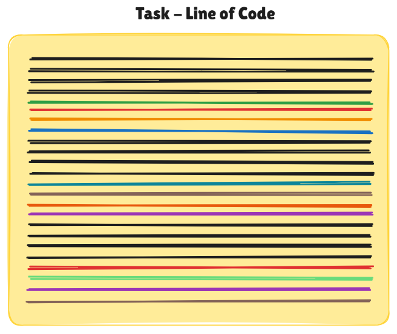
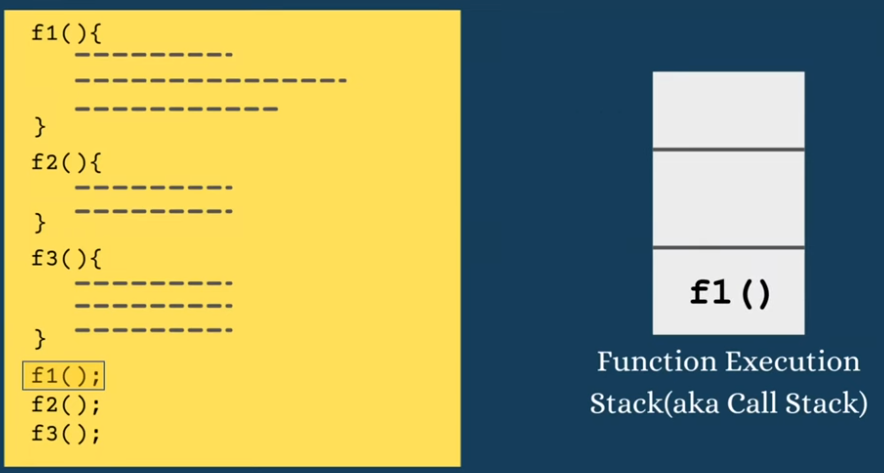
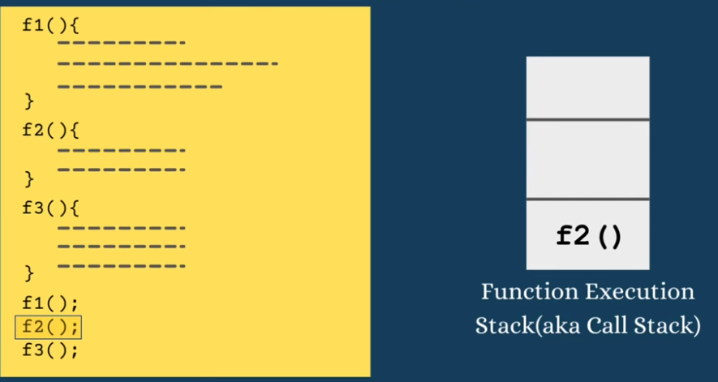
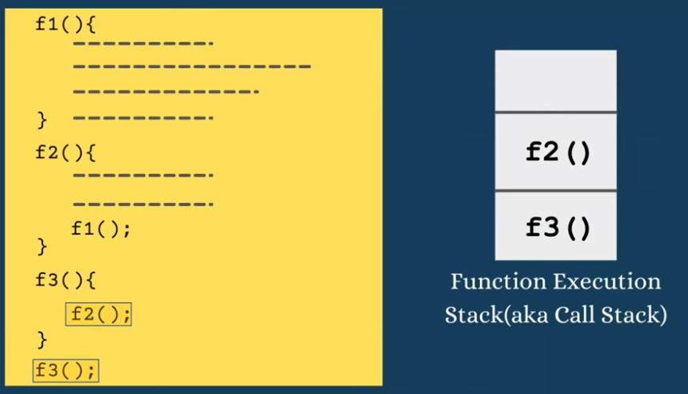

# 🧩 **Functions in JavaScript — Complete Guide**

---

## 📌 **1. What is a Function?**

A **function** is a **reusable block of code** designed to perform a specific task. Functions allow you to **avoid repetition** by grouping commonly used logic and calling it whenever needed.

* **Benefits of Functions**:

  * Reusability
  * Readability
  * Maintainability
  * Reduces code duplication

**Visual Representation:**

  


---

### 🔹 **Syntax**

```js
function functionName() {
    // code to execute
}
```

**Example:**

```js
function print() {
    console.log("My Name is Waqar Rana");
}

print(); // Calls the function
```

---

## 📌 **2. Function Declaration**

A **function declaration** defines a function using the `function` keyword.
It is **hoisted**, meaning it can be called **before or after** its declaration in the code.

```js
console.log(sum(2, 3)); // 5

function sum(a, b) {
    return a + b;
}
```

* **Hoisting**: Function declarations are loaded into memory at runtime before execution.

---

## 📌 **3. Function Definition**

The **function definition** is the actual code that runs inside the function.

```js
function greet(name) {
    return "Hello " + name;
}

console.log(greet("Waqar")); // Hello Waqar
```

---

## 📌 **4. Calling / Invoking a Function**

To **execute a function**, use its name followed by parentheses:

```js
function printName() {
    console.log("Hello!");
}

printName(); // Calls the function
```

---

## 📌 **5. Parameters & Arguments**

### 🔹 Parameters

* Variables defined **inside function parentheses**
* Act as placeholders for input values

```js
function print(name) {
    console.log("My Name is " + name);
}
```

### 🔹 Arguments

* Actual values **passed to the function** when called

```js
print("Waqar Rana");
```

**Example with addition:**

```js
function sum(a, b) {
    console.log(a + b);
}

sum(1, 2); // 3
```

---

## 📌 **6. Return Statement**

The `return` statement **sends a value back** to the function caller.

```js
function sum(a, b) {
    return a + b;
}

const result = sum(2, 3);
console.log(result); // 5
```

**Example with further use:**

```js
function double(num) {
    return num * 2;
}

console.log(double(result)); // 10
```

---

## 📌 **7. Default Parameters**

* Provide default values if arguments are **not supplied**

```js
function calc(a, b = 0) {
    return 2 * (a + b);
}

console.log(calc(1));   // 2
console.log(calc(1, 2)); // 6
```

---

## 📌 **8. Rest Parameters**

* **Collects all remaining arguments** into an array
* Must always be **last parameter**

```js
function calc(...numbers) {
    console.log(numbers);
}

calc(1, 2, 3, 4); // [1, 2, 3, 4]
```

```js
function calc(x, y, ...rest) {
    console.log(x, y, rest);
}

calc(1, 2, 3, 4, 5); // 1 2 [3, 4, 5]
```

⚠ **Rule:** Cannot use rest parameter at the start or middle.

---

## 📌 **9. Nested Functions**

A **nested function** is defined inside another function.

* Can only be called **inside the outer function** unless returned.

```js
function outer() {
    console.log("Outer function");

    function inner() {
        console.log("Inner function");
    }

    inner(); // Inner function called here
}

outer();
```

**Returning inner function for external access:**

```js
function outer() {
    return function inner() {
        console.log("Inner function");
    }
}

const retFunc = outer();
retFunc(); // Inner function
```

---

## 📌 **10. Callback Functions**

A **callback function** is a function passed as an argument to another function and called at a later time.

```js
function print(func) {
    console.log("My Name is Waqar Rana");
    func();
}

print(function() {
    console.log("I am a callback function");
});
```

**Named callback example:**

```js
function callback() {
    console.log("I am a callback function");
}

print(callback);
```

* Can include **conditions** to call callback:

```js
let isCallbackCalled = true;

function print(func) {
    console.log("My Name is Waqar Rana");
    if(isCallbackCalled) {
        func();
    }
}

print(callback);
```

---

## 📌 **11. Pure Functions vs Side Effects**

### 🔹 Pure Function

* Always returns **same output** for same input
* **Does not modify external state**

```js
function greet(name) {
    return "Hello " + name;
}

console.log(greet("Waqar Rana")); // Hello Waqar Rana
```

### 🔹 Side Effects

* Function **depends on external state** or modifies it

```js
let greetingMsg = "Hello ";

function greet(name) {
    return greetingMsg + name;
}

greetingMsg = "Hi ";
console.log(greet("Waqar Rana")); // Hi Waqar Rana
```

---

## 📌 **12. Higher Order Functions**

* Function that **takes another function as argument** or **returns a function**

```js
function calc(a, b, operator) {
    return operator(a, b);
}

function add(a, b) { return a + b; }

console.log(calc(1, 2, add)); // 3
```

**Returning a function:**

```js
function returnFunc() {
    return function() {
        console.log("I am a returned function");
    }
}

const retFunc = returnFunc();
retFunc();
```

### 🔹 Callback vs Higher Order Function

| Feature    | Callback Function            | Higher Order Function                    |
| ---------- | ---------------------------- | ---------------------------------------- |
| Definition | Passed to another function   | Takes or returns a function              |
| Purpose    | Executed later in the caller | Can manipulate or return other functions |
| Example    | `print(callback)`            | `calc(a,b, operator)`                    |

---

## 📌 **13. Arrow Functions**

* Compact function syntax
* Implicit return if only one expression
* Optional parentheses for **single parameter**

```js
const add = (a, b) => a + b;
console.log(add(1, 2)); // 3

const greet = name => "Hello " + name;
console.log(greet("Waqar")); // Hello Waqar
```

```js
const logMessage = () => console.log("I am arrow function");
logMessage();
```

---

## 📌 **14. IIFE (Immediately Invoked Function Expression)**

* Function **executes immediately** after creation

```js
(function() {
    console.log("I am IIFE");
})();
```

**With parameters:**

```js
(function(a, b) {
    console.log(a + b);
})(1, 2); // 3
```

---

## 📌 **15. Call Stack**

* JavaScript uses a **stack (LIFO)** to track function execution
* Each function call is **pushed** onto the stack
* After execution, it is **popped off**

**Example:**

```js
function f1() {}
function f2() { f1(); }
f2();
```

**Visual diagram:** 


**Step by step execution:**










---

---

## 📌 **16. Recursion**

* Function **calling itself**
* Needs **base condition** to stop recursion
* Memory cost due to stack

```js
function fetchWater(count) {
    console.log("Fetching water", count);

    if(count === 0) {
        console.log("Water fetched successfully");
        return;
    }

    fetchWater(count - 1);
}

fetchWater(5);
```

**Infinite recursion causes stack overflow:**

```js
function infinite() {
    infinite();
}
```

---

## 📌 **17. Loop vs Recursion**

| Feature     | Loop             | Recursion                    |
| ----------- | ---------------- | ---------------------------- |
| Memory      | Reuses memory    | Stack memory increases       |
| Readability | Simple           | Good for tree/DFS structures |
| Use case    | Repetitive tasks | Hierarchical/recursive tasks |
| Risk        | Low              | Stack overflow if no base    |

---

## Home Tasks

1. Convert Celsius → Fahrenheit
2. Find Maximum of Two Numbers
3. Check Palindrome String
4. Factorial of Number
5. Count Vowels in String
6. Capitalize First Letter of Each Word
7. IIFE to print “Hello, JavaScript!”
8. Create a simple callback function
9. Call Stack diagram examples
10. Calculate area of rectangle (regular, anonymous, arrow)
11. Process numbers with callback
12. Anonymous function: even/odd
13. Arrow function: Positive/Negative/Zero
14. IIFE to print current date
15. Callback inside loop executed each iteration
16. Write a function to reverse a string
17. Write a function to check if a number is prime
18. Write a recursive function to sum all elements of an array
19. Write a function to flatten a nested array
20. Write a function to remove duplicates from an array
21. Write a function that returns the Fibonacci sequence up to n
22. Write a function to merge two arrays and sort them
23. Write an arrow function to calculate square of numbers in an array using `map`
24. Write a function to simulate a simple calculator using callbacks


