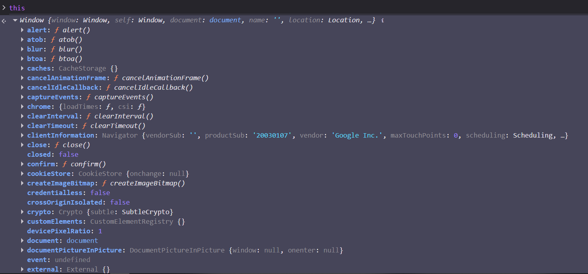
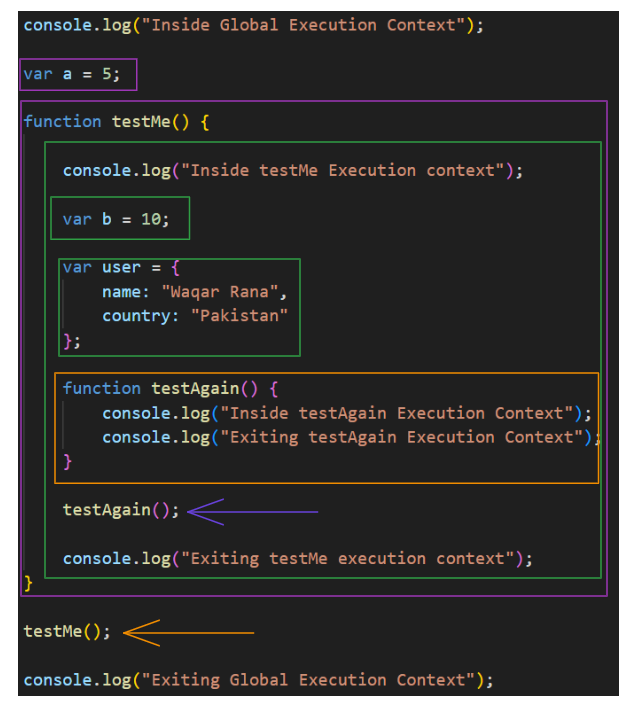
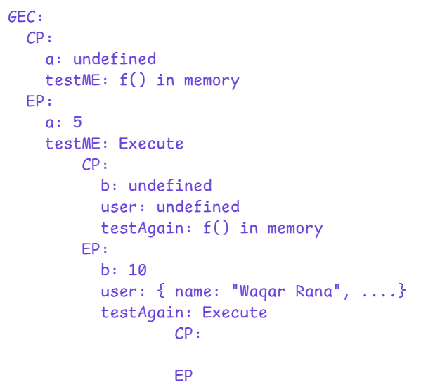
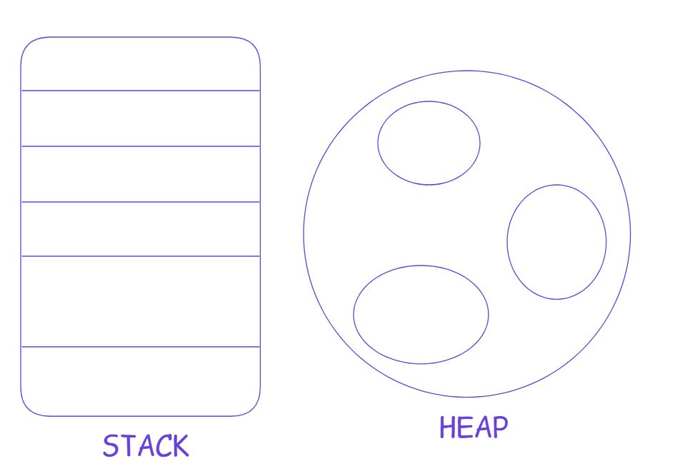
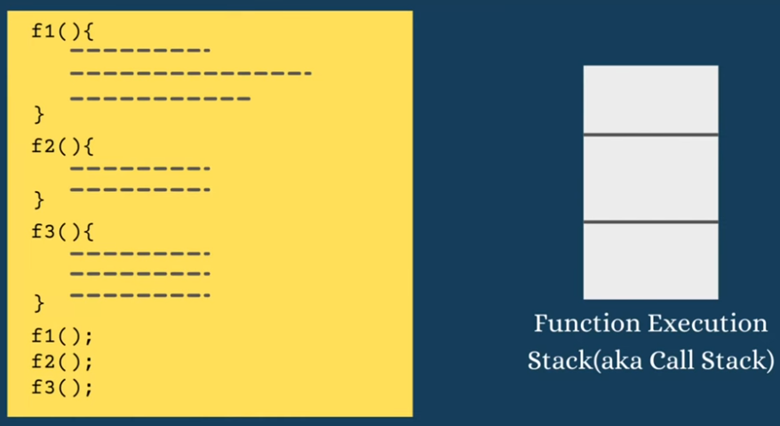
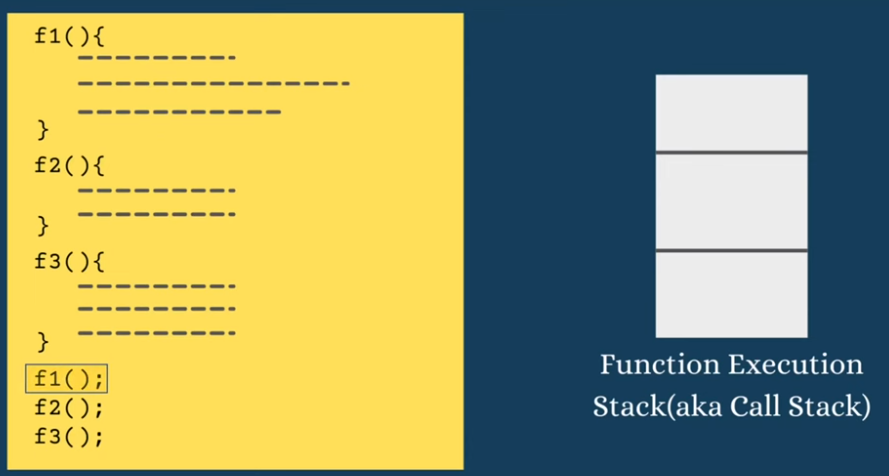
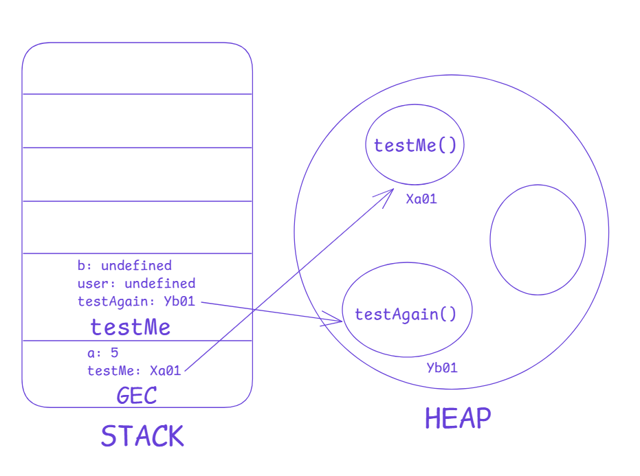
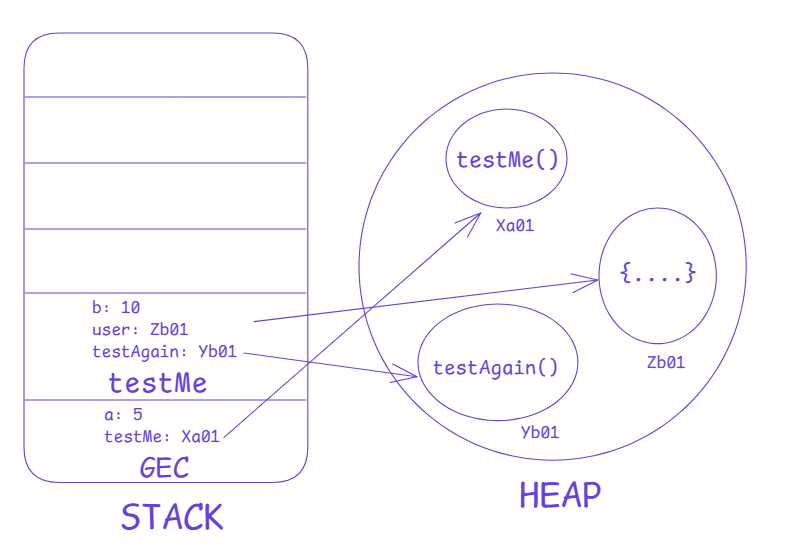
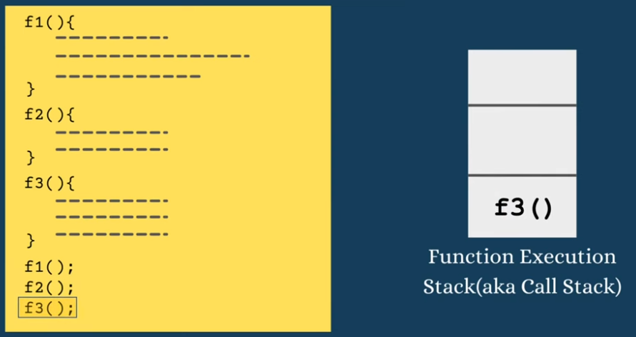
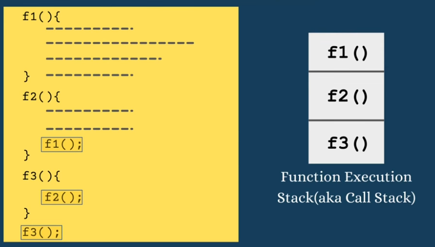

## 📘 **Execution Context in JavaScript**

---

## 📘 **Lexical Environment**

### 🔷 **What Does “Lexical” Mean?**

The word **lexical** comes from the word **“lexicon”**, meaning:

✔ related to **words** <br>
✔ related to **how something is written** <br>
✔ related to **placement** <br>

In JavaScript, **lexical means where your code sits physically in the file**.

---

### 🔷 **What Is a Lexical Environment?**

A **Lexical Environment** is:

> **The place where a piece of code physically lives + the variables it can access + a reference to its outer environment.**

Every time JavaScript executes code, it creates a **lexical environment** containing:

## 🔷 **Understanding the Word “Context” First**

Before learning **Execution Context**, understand the meaning of the word **context**.

### ✔ What is Context?

> “Context” means the **circumstances**, **environment**, or **background information** that help an event happen.

### 🔍 Example

If someone says:

> “I scored low in the test.”

You ask:

> “In what context?”

You want to know:

* What happened?
* What were the conditions?
* What was the situation?

So **context gives extra information**.

### ✔ Connecting This to JavaScript

Similarly:

> **Execution Context gives extra information about the code that is currently running and everything around it that helps JavaScript execute that code.**

---

## 🔷 **Definition of Execution Context**

### ✔ Simple Definition:

> **Execution Context means: the code that is currently running + everything needed to run it (variables, functions, scope, memory, `this`, etc.).**

JS creates this environment automatically before executing your code.

---

## 🔷 **Global Execution Context (GEC)**

When any JavaScript program starts, JavaScript automatically creates:

> **Global Execution Context (GEC)**

### ✔ What is Global?

Global = everything outside any function.

Even if your JS file contains **0 lines**, JS creates:

* `window` object → global object
* `this` keyword → pointing to `window`
* global memory
* global scope

### ✔ Example

Even if your JS file is empty:

```js
// empty
```

Opening it in the browser console and typing `this` gives you:

```
window { ... }
```

This proves JS already created **Execution Context**.

---

## 🔷 **`this` in Global Execution Context**

JS gives a special keyword:

```
this
```

In Global Execution Context:

```
this === window   // true (in browser)
```

Because both point to the **same memory location**.

**Diagram**



---

## 🔷 **Two Phases of Global Execution Context**

The GEC has **two phases**:

---

### ⭐ **1) Creation Phase**

In this phase:

1. Variables are initialized with **undefined**
2. Functions are stored in memory

Example:

```js
var name = "Waqar";
function sayName() {
    console.log("The name is " + this.name);
}
```

### ✔ Creation Phase Memory:


---

### ⭐ **2) Execution Phase**

Now JS runs your code line-by-line:

1. Assigns actual values

   ```
   name = "Waqar"
   ```
2. Skips running `sayName()` because it is **not called yet**

Execution happens only when JS **encounters** the function call.

---

## 🔷 **When You Call a Function → Function Execution Context (FEC)**

Calling:

```js
sayName();
```

creates:

> **Function Execution Context (FEC)**

Every function has **its own Execution Context**.

---

## ⭐ **FEC Phases**

FEC also has **two phases**:

---

### 🔵 **1) Creation Phase of Function Execution Context**

In this phase JS:

1. parameters = **undefined**
2. local variables = **undefined**
3. inner functions = stored in memory

---

### 🔵 **2) Execution Phase of FEC**

Now JS runs the function.

Example:

```js
function sayName() {
    console.log("The name is " + this.name);
}
sayName();
```

Execution phase:

✔ Runs `console.log`
✔ Prints:

```
The name is Waqar
```

---

## 🔷 **Call Stack (Execution Stack)**

JavaScript uses a **stack** (LIFO) to manage all Execution Contexts.

### ✔ Order:

1. Global Execution Context (GEC) is created → pushed first
2. When a function is called → FEC pushed
3. When function ends → its FEC removed
4. When program ends → GEC removed

---

## 🔷 **Example**

```js
console.log("Inside Global Execution Context");

var a = 5;

function testMe() {

    console.log("Inside testMe Execution context");

    var b = 10;

    var user = {
        name: "Waqar Rana",
        country: "Pakistan"
    };

    function testAgain() {
        console.log("Inside testAgain Execution Context");
        console.log("Exiting testAgain Execution Context");
    }

    testAgain();

    console.log("Exiting testMe execution context");
}

testMe();

console.log("Exiting Global Execution Context");
```

---

## 🔥 Step-by-Step Execution (with Call Stack Diagrams)

---

 <span>  </span>

### ✔ Step 1: GEC Creation Phase



 <span>  </span>

### ✔ Step 2: GEC Execution Phase

 <span>  </span>

### ✔ Step 3: FEC (testMe) Creation Phase

 <span>  </span>

### ✔ Step 4: FEC (testMe) Execution Phase

 <span>  </span>

### ✔ Step 5: FEC (testAgain) Creation Phase

 <span>  </span>

### ✔ Step 6: FEC (testAgain) Execution Phase

 <span>  </span>

---

How Comeout from stack?

step 01:



step 02:




step 03:


---

## 🔥 Home Task:

Draw the execution context diagram of the following code and share as explained below.

```js
const message = "I can do it";

fucntion sum(a, b) {
    const result = a + b;
    return result;
}

function mul(a, b) {
    const result = a * b;
    return result;
}
function calc(a, b) {
    return (sum(a, b) + mul(a,b))/2;
}

function getResult(a, b) {
    return calc(a, b);
}

getResult(8, 5);
```

Create the GEC and FEC with CP and EP flow <br>
Create the Stack and Heap Flow <br>
Create the Stack Diagram <br>