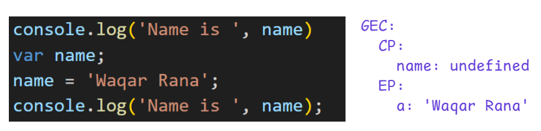
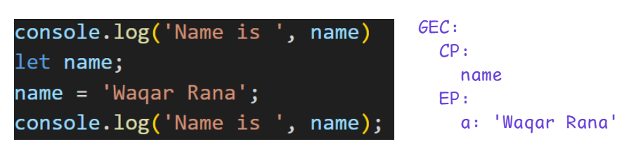
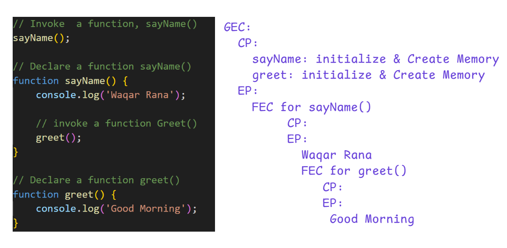

# **Variable Hoisting & Temporal Dead Zone (TDZ) – Detailed Explanation**

## **1. Variable Hoisting (“Variable Wasting”)**

*Variable Wasting* means the variable is **pulled up** (hoisted) during the **Creation Phase** of the Global Execution Context (GEC).

### Example with `var`

```js
console.log('Name is ', name);
var name;
name = 'Waqar Rana';
console.log('Name is ', name);
```

When this code runs, the first log prints:

```
Name is  undefined
```

No error occurs because `var` variables are **hoisted and initialized with `undefined`**.

### Global Execution Context Diagram

Example: 

This behavior often causes confusion, bugs, and difficulty in debugging. That is why we use `let` and `const`.

---

## **2. Hoisting with `let` and `const`**

### Example with `let`

```js
console.log('Name is ', name);
let name;
name = 'Waqar Rana';
console.log('Name is ', name);
```

This will throw:

```
ReferenceError: Cannot access 'name' before initialization
```

Many people think `let` and `const` “stop hoisting,” but this is not true.

JavaScript **still hoists** `let` and `const`, but **does NOT initialize them**.
They stay in the **Temporal Dead Zone (TDZ)** until the line where they are initialized.

### GEC Diagram

Example: 

---

## **3. Example with `const`**

```js
console.log('Name is ', name);
const name;
name = 'Waqar Rana';
console.log('Name is ', name);
```

This throws:

```
SyntaxError: Missing initializer in const declaration
```

Because `const` **must be initialized on the same line**.

But even with correct initialization:

```js
console.log('Name is ', name);
const name = 'Waqar Rana';
console.log('Name is ', name);
```

This still throws:

```
ReferenceError: Cannot access 'name' before initialization
```

Because the variable is still inside the **Temporal Dead Zone** before initialization.

---

# **4. Temporal Dead Zone (TDZ)**

**TDZ Definition:**
A region of code where a variable exists but **cannot be accessed** until it is initialized.

Accessing it results in:

```
ReferenceError
```

### Understanding TDZ with Blocks

A block is simply:

```js
{
   // block scope
}
```

Example:

```js
{
    console.log('Name is ', name);
    let name = "Waqar Rana";
}
```

Explanation:

* TDZ starts from the **beginning of the block**
* TDZ ends at the **initialization line**

### TDZ Visual Example

```js
{
    // Name variable's TDZ starts here
    console.log('Name is ', name); // ReferenceError
    let name = "Waqar Rana";       // TDZ ends here
}
```

### Another Example (Multiple Variables)

```js
{
    // TDZ for name & address starts here
    console.log('Name is ', name);     // ReferenceError
    console.log('Address is ', address); // ReferenceError

    let address = "Karachi";  // TDZ ends for address
    let name = "Waqar Rana";  // TDZ ends for name
}
```

### Example after TDZ ends

```js
{
    console.log('Name is ', name);     // ReferenceError
    console.log('Address is ', address); // ReferenceError

    let address = "Karachi";  
    let name = "Waqar Rana";          

    console.log('Name is ', name);     // Works
    console.log('Address is ', address); // Works
}
```

---

# **5. Functional Hoisting**

### Example:

```js
// Invoke
sayName();

// Declare
function sayName() {
    console.log('Waqar Rana');
    greet();
}

function greet() {
    console.log('Good Morning');
}
```

### Output:

```
Waqar Rana
Good Morning
```

### Why?

Because during the **Creation Phase**, JavaScript performs:

* **Variable Hoisting** (memory allocated, set to `undefined`)
* **Functional Hoisting** (complete function stored in memory)

Functional hoisting means the **entire function memory** is created before execution.

### Functional Hoisting Diagram

Example:  

---

# **6. Function Expression Hoisting**

```js
test();

var test = function () {
    console.log('I am being tested');
}
```

This throws:

```
TypeError: test is not a function
```

Why?

Because:

* `var test` is hoisted and initialized as `undefined`
* But the **function expression is NOT hoisted**
* So at the time of `test()`, test = `undefined`

### Diagram

Example: 

---

# **Summary**

| Keyword   | Hoisted? | Initialized? | TDZ? | Error When Accessed Early        |
| --------- | -------- | ------------ | ---- | -------------------------------- |
| **var**   | Yes      | `undefined`  | No   | `undefined`                      |
| **let**   | Yes      | No           | Yes  | ReferenceError                   |
| **const** | Yes      | No           | Yes  | ReferenceError + must initialize |

---
