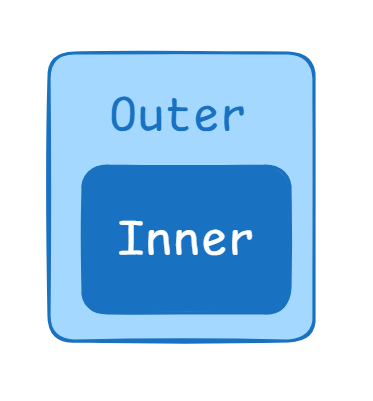

# Closures in JavaScript

---

# What you need first

To understand closures you should already know:

* Inner and outer functions
* Scopes (local / outer / global)
* How functions are created and returned



---

# What is a closure? — Simple & technical

**Simple definition:**
A *closure* is a function that **remembers the variables** from its outer (enclosing) function, even after that outer function has finished executing.

**Technical definition:**
A closure is formed when a function retains access to its lexical environment (the variables and bindings from its outer scopes) after the outer function has returned. That means the inner function keeps a reference to the environment where it was created.

---

# Example

### Lexical access (not a closure by itself)

```js
function outerFunction() {
  let outerVariable = 'I am from outer function';

  function innerFunction() {
    console.log(outerVariable);
  }

  innerFunction();
}

outerFunction(); // logs: I am from outer function
```

* `innerFunction` can access `outerVariable` because of lexical scope.
* This is normal scope access; the outer function is still running when `innerFunction` is called.

### Closure example (inner function returned)

```js
function outerFunction() {
  let outerVariable = 'I am from outer function';

  return function innerFunction() {
    console.log(outerVariable);
  }
}

const inner = outerFunction();
inner(); // logs: I am from outer function
```

* Here `outerFunction()` has finished execution, but `inner` still logs `outerVariable`.
* That retained access is **the closure**.

---

# Counter example

```js
function outerCounter() {
  let count = 0;

  return function innerCounter() {
    count++;
    console.log(count);
  }
}

const inner = outerCounter();
inner(); // 1
inner(); // 2
inner(); // 3
```

* Each call to `inner()` can read and modify `count`. The value `count` persists across calls because the inner function closes over it.

---

# Why closures work: lexical environment + references

* When a function is created, JS stores a reference to its lexical environment (variables in outer scopes).
* If an inner function is returned or referenced outside its outer function, that lexical environment is kept *alive* (not garbage collected) as long as the closure exists.
* The closure holds references to variables, not copies — so if the variable changes through the closure, you observe the change.

---

# Usefulness of closures (practical reasons)

1. **Private data / encapsulation**
   Keep variables private (not accessible from global scope).

   ```js
   function createCounter() {
     let count = 0;
     return {
       increment() { count++; },
       get() { return count; }
     };
   }
   const c = createCounter();
   c.increment();
   console.log(c.get()); // 1
   // count is not accessible directly from outside
   ```

2. **Avoid global variable pollution**
   Keep variables inside closures instead of putting everything on window/global.

3. **Function factories / partial application**
   Produce customized functions.

   ```js
   function makeAdder(x) {
     return function(y) {
       return x + y;
     };
   }
   const add5 = makeAdder(5);
   console.log(add5(2)); // 7
   ```

4. **Maintain state between calls**
   e.g., a counter, memoization cache, sequence generator.

5. **Callbacks and asynchronous code**
   Closures let callbacks access data that was present when the callback was created (e.g., event handlers, timers, promises).

6. **Module pattern**
   Build modules that expose API but hide internal variables.

---

# Common closure patterns & examples

### Private variable (singleton-like)

```js
const Counter = (function() {
  let count = 0;
  return {
    inc() { count++; return count; },
    value() { return count; }
  };
})();

console.log(Counter.inc()); // 1
console.log(Counter.value()); // 1
```

### Factory / partially applied function

```js
function multiplyBy(n) {
  return function(x) {
    return x * n;
  };
}
const double = multiplyBy(2);
console.log(double(5)); // 10
```

### Event-handler example (closure used in UI)

```js
function attachCountingHandler(button) {
  let clicks = 0;
  button.addEventListener('click', () => {
    clicks++;
    console.log('Clicks:', clicks);
  });
}
```

Each handler keeps its own `clicks`.

---

# Common mistakes and pitfalls

### 1. Memory leaks from long-lived closures

* If closures keep references to large objects or DOM nodes and are never released, memory will stay allocated.
* Example bad pattern:

  ```js
  function createStore() {
    const big = new Array(1000000).fill('x');
    return function() {
      console.log(big[0]);
    };
  }
  const f = createStore(); // `big` stays in memory while `f` exists
  ```
* **Fix**: avoid capturing large unnecessary objects; null out references when no longer needed.

### 2. Loop closures (classic `var` issue)

```js
for (var i = 0; i < 3; i++) {
  setTimeout(function() { console.log(i); }, 100);
}
// prints 3, 3, 3
```

**Why:** `var i` is function-scoped; all closures share the same `i` (after loop it's 3).

**Fixes:**

* Use block-scoped `let`:

  ```js
  for (let i = 0; i < 3; i++) {
    setTimeout(function() { console.log(i); }, 100);
  }
  // prints 0,1,2
  ```
* Create a new scope per iteration:

  ```js
  for (var i = 0; i < 3; i++) {
    (function(j){
      setTimeout(function(){ console.log(j); }, 100);
    })(i);
  }
  ```

### 3. Unexpected shared references

When closures capture an object reference, modifying the object affects all closures that reference it.

---

# Closure vs Scope

* **Scope (lexical scope)** is a compile-time concept: where a variable is *defined and visible*.
* **Closure** is a runtime mechanism: when a function *retains* access to variables from its lexical scope even after that scope has ended.

---

# Garbage collection & closure lifetime

* A closure’s lexical environment remains alive while something still references the inner function (or the environment).
* When no references remain, the environment becomes eligible for garbage collection.
* **Be cautious** when closures hold references to large structures or DOM nodes — remove references if not needed.

---

# Best practices when using closures

1. **Prefer `let`/`const`** to avoid `var`-scoped surprises.
2. **Keep captured state small** — don’t capture whole large objects if only a small piece is needed.
3. **Nullify references** when you are done (e.g., remove event listeners, set variables to `null`).
4. **Use closures intentionally** for encapsulation and state, not as accidental global replacements.
5. **Document** why a closure holds some state — it helps future maintainers.

---

# Useful closure-based patterns

* Module pattern (private state + public API)
* Function factories (curried or specialized functions)
* Memoization / caching
* Event handlers with private state
* Throttling/debouncing (use closure to store timer id)
* Iterators/generators (maintain internal index)

---

# Quick FAQ

**Q:** Do closures copy variables?
**A:** No — closures keep **references** to variables in their lexical environment (not copies).

**Q:** Are closures slow or memory heavy?
**A:** Not necessarily. They do keep environments alive, so misuse (capturing large objects) can increase memory usage.

**Q:** When are closures created?
**A:** When a function is created. If that function references outer variables and is returned or escapes its scope, a closure is formed.

---