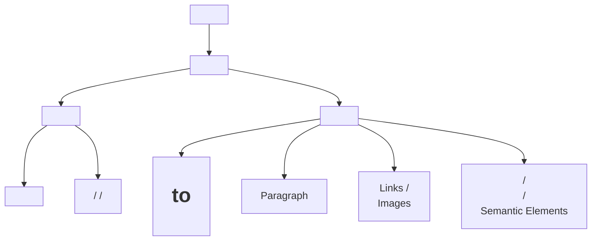

# 📘 HTML (HyperText Markup Language)

## 🟢 Introduction

**HTML (HyperText Markup Language)** is the **standard markup language** that defines the **structure of a web page**. It tells the browser **how to display content** like text, images, videos, and links.

---

### 📜 Key Facts

| Property            | Details                                  |
| ------------------- | ---------------------------------------- |
| **Inventor**        | Tim Berners-Lee                          |
| **Introduced**      | 1991                                     |
| **Purpose**         | To structure and display web content     |
| **Standardized by** | W3C (World Wide Web Consortium) & WHATWG |

---

## 🧩 Versions of HTML

| Version       | Year | Key Features                                                        |
| ------------- | ---- | ------------------------------------------------------------------- |
| **HTML 1.0**  | 1991 | Basic text and links only                                           |
| **HTML 2.0**  | 1995 | Introduced forms & tables                                           |
| **HTML 3.2**  | 1997 | Added scripting & style support                                     |
| **HTML 4.01** | 1999 | Introduced CSS separation                                           |
| **XHTML**     | 2000 | XML-based, stricter syntax                                          |
| **HTML5**     | 2014 | Multimedia, semantic tags, canvas, local storage, responsive design |

---

## 🏗️ Basic Structure of an HTML Document

### 📄 Example:

```html
<!DOCTYPE html>
<html>
<head>
  <title>My Web Page</title>
</head>
<body>
  <h1>Hello, World!</h1>
  <p>Welcome to my first HTML page.</p>
</body>
</html>
```

---

### 🧠 Explanation:

| Tag               | Meaning                                     |
| ----------------- | ------------------------------------------- |
| `<!DOCTYPE html>` | Declares document type (HTML5).             |
| `<html>`          | Root element that wraps all content.        |
| `<head>`          | Metadata section (title, styles, scripts).  |
| `<title>`         | Defines the title shown in the browser tab. |
| `<body>`          | Contains visible page content.              |

---

### 🪄 HTML Document Structure (Mermaid Diagram)



---

## ✍️ Text-Related Tags

HTML provides various tags to **display, format, and structure text content**.

---

### 🧱 1. Headings

* **Tags**: `<h1>` to `<h6>`
* **Purpose**: Define headings, `<h1>` being the largest and most important.

#### Example:

```html
<h1>Main Heading</h1>
<h2>Sub Heading</h2>
<h3>Minor Heading</h3>
<h4>Small Heading</h4>
<h5>Smaller Heading</h5>
<h6>Smallest Heading</h6>
```

---

### 📝 2. Paragraph

* **Tag**: `<p>`
* **Purpose**: Defines a block of text.

#### Example:

```html
<p>This is a simple paragraph written in HTML.</p>
```

---

### 🔄 3. Line Break

* **Tag**: `<br>`
* **Purpose**: Inserts a line break (new line) inside text.

#### Example:

```html
<p>Hello!<br>Welcome to HTML learning.</p>
```

---

### ➖ 4. Horizontal Rule

* **Tag**: `<hr>`
* **Purpose**: Creates a horizontal divider line between sections.

#### Example:

```html
<p>Section 1 Content</p>
<hr>
<p>Section 2 Content</p>
```

---

### ✨ 5. Formatting Tags

HTML offers **text formatting tags** for styling and meaning.

| Tag        | Description                  | Example                      |
| ---------- | ---------------------------- | ---------------------------- |
| `<b>`      | Bold (no special meaning)    | `<b>Bold Text</b>`           |
| `<strong>` | Important text (semantic)    | `<strong>Important</strong>` |
| `<i>`      | Italic (no meaning)          | `<i>Italic Text</i>`         |
| `<em>`     | Emphasized (semantic italic) | `<em>Emphasized Text</em>`   |
| `<u>`      | Underlined text              | `<u>Underlined Text</u>`     |
| `<sup>`    | Superscript                  | `x<sup>2</sup>`              |
| `<sub>`    | Subscript                    | `H<sub>2</sub>O`             |
| `<del>`    | Deleted (strikethrough)      | `<del>Removed</del>`         |
| `<ins>`    | Inserted (underlined)        | `<ins>Added</ins>`           |

#### Example:

```html
<p>This is <b>bold</b>, <i>italic</i>, and <u>underlined</u> text.</p>
<p>This is <strong>important</strong> and <em>emphasized</em> text.</p>
<p>Water formula is H<sub>2</sub>O and area of square is a<sup>2</sup>.</p>
<p><del>Old Price: $100</del> <ins>New Price: $80</ins></p>
```

---

### 🌐 Full Example with All Text Tags

```html
<!DOCTYPE html>
<html>
<head>
  <title>HTML Text Tags Example</title>
</head>
<body>
  <h1>HTML Text Example</h1>
  <p>This is a <strong>strong</strong> paragraph with <em>emphasized</em> and <u>underlined</u> text.</p>
  <p>Water = H<sub>2</sub>O and Equation: E = mc<sup>2</sup></p>
  <hr>
  <p><del>Old Version</del> <ins>Updated Version</ins></p>
</body>
</html>
```

---

# 📋 Lists in HTML

Lists in **HTML** help organize related content in a **structured and easy-to-read format**.
They are widely used for menus, steps, outlines, and grouped information.

---

## 🧩 Types of Lists in HTML

There are **four main types** of lists:

1. **Ordered List (`<ol>`)** — Numbered list
2. **Unordered List (`<ul>`)** — Bulleted list
3. **Description List (`<dl>`)** — Term-definition list
4. **Nested List** — A list inside another list

---

## 🔹 1. Ordered List (`<ol>`)

### 📖 Definition

An **ordered list** displays items in a **specific sequence**, such as numbers or letters.

---

### ⚙️ Attributes

| Attribute  | Description              | Example Value           |
| ---------- | ------------------------ | ----------------------- |
| `type`     | Defines numbering style  | `1`, `A`, `a`, `I`, `i` |
| `start`    | Sets the starting number | `start="5"`             |
| `reversed` | Reverses numbering order | `reversed`              |

---

### 💡 Example

```html
<ol type="A" start="3" reversed>
  <li>HTML</li>
  <li>CSS</li>
  <li>JavaScript</li>
</ol>
```

#### 🖥️ Output:

C. HTML
B. CSS
A. JavaScript

---

## 🔹 2. Unordered List (`<ul>`)

### 📖 Definition

An **unordered list** shows items with **bullets** instead of numbers.
Perfect for lists where order doesn’t matter.

---

### ⚙️ Attribute

| Attribute | Description                       | Note            |
| --------- | --------------------------------- | --------------- |
| `type`    | Defines bullet style (deprecated) | Use CSS instead |

💡 **CSS Example for Bullets:**

```css
ul {
  list-style-type: square; /* options: disc, circle, none */
}
```

---

### 💡 Example

```html
<ul>
  <li>Apple</li>
  <li>Banana</li>
  <li>Cherry</li>
</ul>
```

#### 🖥️ Output:

* Apple
* Banana
* Cherry

---

## 🔹 3. Description List (`<dl>`)

### 📖 Definition

A **description list** displays **terms** and their **definitions** — like a glossary or dictionary.

---

### 💡 Example

```html
<dl>
  <dt>HTML</dt>
  <dd>HyperText Markup Language - structures web pages.</dd>

  <dt>CSS</dt>
  <dd>Cascading Style Sheets - styles web pages.</dd>

  <dt>JavaScript</dt>
  <dd>Adds interactivity to web pages.</dd>
</dl>
```

#### 🖥️ Output:

**HTML** — HyperText Markup Language - structures web pages.
**CSS** — Cascading Style Sheets - styles web pages.
**JavaScript** — Adds interactivity to web pages.

---

## 🔹 4. Nested List

### 📖 Definition

A **nested list** is a list placed **inside another list item**.
You can mix **ordered** and **unordered** lists together.

---

### 💡 Example 1: Unordered Nested Inside Unordered

```html
<ul>
  <li>Fruits
    <ul>
      <li>Apple</li>
      <li>Banana</li>
      <li>Cherry</li>
    </ul>
  </li>
  <li>Vegetables
    <ul>
      <li>Carrot</li>
      <li>Spinach</li>
    </ul>
  </li>
</ul>
```

#### 🖥️ Output:

* Fruits

  * Apple
  * Banana
  * Cherry
* Vegetables

  * Carrot
  * Spinach

---

### 💡 Example 2: Ordered + Unordered Mix

```html
<ol>
  <li>Frontend
    <ul>
      <li>HTML</li>
      <li>CSS</li>
      <li>JavaScript</li>
    </ul>
  </li>
  <li>Backend
    <ul>
      <li>Node.js</li>
      <li>Express</li>
    </ul>
  </li>
</ol>
```

#### 🖥️ Output:

1. Frontend

   * HTML
   * CSS
   * JavaScript
2. Backend

   * Node.js
   * Express

---

## 🧭 Lists Structure Diagram (Mermaid)

```mermaid
graph TD
A[HTML Lists] --> B[Ordered List <ol>]
A --> C[Unordered List <ul>]
A --> D[Description List <dl>]
A --> E[Nested List]
B --> F[<li> Items]
C --> G[<li> Items]
D --> H[<dt> Term]
D --> I[<dd> Definition]
E --> J[Parent List]
E --> K[Child List (Nested)]
```

---

## 🎯 Conclusion

✅ **Lists** organize information clearly and meaningfully.
✅ Use **Ordered Lists** when sequence matters.
✅ Use **Unordered Lists** for unordered collections.
✅ Use **Description Lists** for term-definition pairs.
✅ Use **Nested Lists** for hierarchical or grouped data.
✅ **Styling** can be customized using **CSS** for better visuals.

---