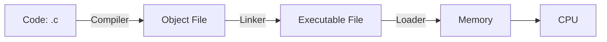
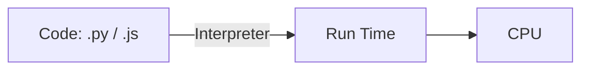
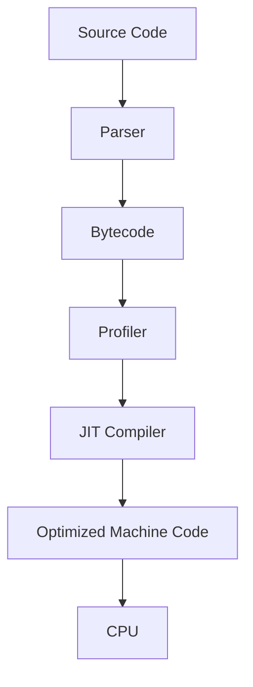

# JavaScript Introduction

---

## What is a Language?

A **language** is a way of communication. It uses words, signs, or rules so people (or machines) can understand each other.

* **Natural languages**: Human languages like English, Urdu, Chinese.
* **Programming languages**: Special languages made for computers. They follow strict rules so computers can understand and run them.

---

## What is a Programming Language?

A **programming language** is a way to talk to computers. With it, we can:

* Tell computers what to do.
* Build software and apps.
* Control hardware (like printers, phones, or sensors).

Examples: **JavaScript, Python, C, C++**.

---

## Types of Programming Languages

Programming languages are of different types, based on how close they are to human thinking or machine instructions.

### 1) High-Level Languages

* Easy to read and write.
* Similar to human language.
* Work on many computers without changes.

**Examples:** JavaScript, Python, Java.

**Example in JavaScript:**

```javascript
function greet(name) {
  return `Hello, ${name}!`;
}

console.log(greet('Rana'));
```

---

### 2) Mid-Level Languages

* Mix of high-level and low-level features.
* Can talk to hardware but also easy enough for humans.
* Used for system programming.

**Examples:** C, C++, Rust.

**Example in C:**

```c
#include <stdio.h>
int main() {
    printf("Hello, Rana!\n");
    return 0;
}
```

---

### 3) Low-Level Languages

* Very close to machine instructions.
* Hard to write but very powerful.
* Directly controls the CPU and memory.

**Examples:** Assembly language, Machine code.

**Example (Assembly):**

```asm
section .data
  msg db "Hello, Rana!", 0xA
  len equ $ - msg

section .text
  global _start

_start:
  mov rax, 1   ; write
  mov rdi, 1   ; output
  mov rsi, msg
  mov rdx, len
  syscall

  mov rax, 60  ; exit
  xor rdi, rdi
  syscall
```

---

### 4) Very High-Level Languages (VHLL)

* Even easier than high-level.
* Made for specific tasks like data or maths.

**Examples:** SQL (databases), MATLAB (maths), R (statistics).

---

## Language Translators

Computers only understand **0s and 1s (machine code)**. Translators convert our code into machine code.

### Compiler

* Changes the whole program into machine code before running.
* Makes an **executable file**.
* Very fast when running.

**Examples:** C, C++.

### Interpreter

* Reads code **line by line** and runs it immediately.
* No executable file is made.
* Slower, but good for testing.

**Examples:** Python, JavaScript.

### Assembler

* Converts **assembly language** into machine code.
* Works line by line.

**Examples:** x86, ARM.

### Just-In-Time (JIT) Compiler

* Mix of both compiler and interpreter.
* Runs code quickly by compiling the most-used parts.
* Used in modern JavaScript engines like **V8** (Chrome, Node.js).

---

## Essential Tools for Every Programmer

To write and run code, programmers use some tools:

### 1) Code Editor

* A place where we write code.
* Highlights code, shows errors, and helps with auto-complete.

**Examples:** VS Code, Sublime Text, Notepad++.

---

### 2) Language Translator

* Converts human code into machine code.
* Includes **compiler, interpreter, assembler**.

---

### 3) Linker

* Joins many small code files into one big program.

---

### 4) Loader

* Loads the program into memory so the CPU can run it.

---

### 5) Debugger

* Helps find and fix errors (bugs).
* Lets you pause, check variables, and run step by step.

**Examples:** Chrome DevTools (JS), Node Inspector, GDB (C).

---

## Toolchain — How Programs Run

### Compiled Language (C/C++)



### Interpreted Language (Python / JavaScript)



### JIT (JavaScript Engines like V8)

