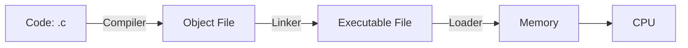
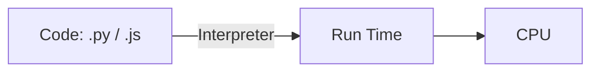
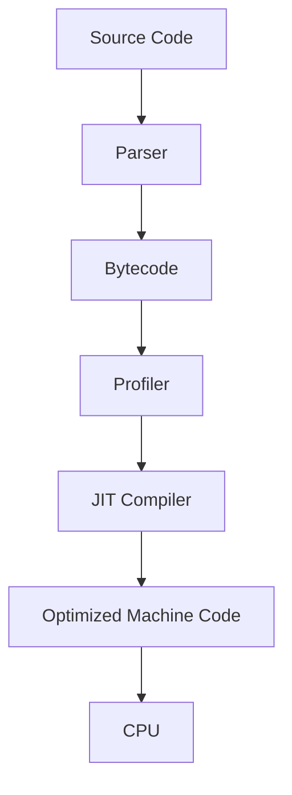
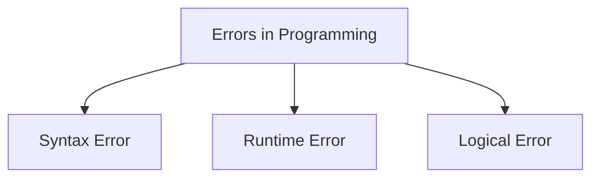
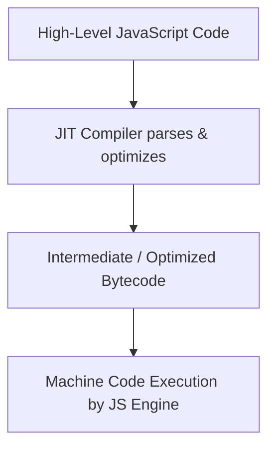
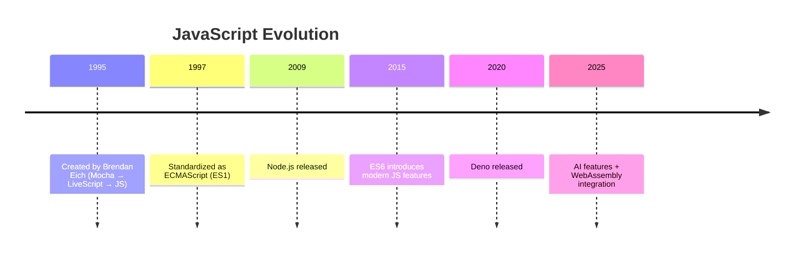

# JavaScript Introduction

---

## What is a Language?

A **language** is a way of communication. It uses words, signs, or rules so people (or machines) can understand each other.

* **Natural languages**: Human languages like English, Urdu, Chinese.
* **Programming languages**: Special languages made for computers. They follow strict rules so computers can understand and run them.

---

## What is a Programming Language?

A **programming language** is a way to talk to computers. With it, we can:

* Tell computers what to do.
* Build software and apps.
* Control hardware (like printers, phones, or sensors).

Examples: **JavaScript, Python, C, C++**.

---

## Types of Programming Languages

Programming languages are of different types, based on how close they are to human thinking or machine instructions.

### 1) High-Level Languages

* Easy to read and write.
* Similar to human language.
* Work on many computers without changes.

**Examples:** JavaScript, Python, Java.

**Example in JavaScript:**

```javascript
function greet(name) {
  return `Hello, ${name}!`;
}

console.log(greet('Rana'));
```

---

### 2) Mid-Level Languages

* Mix of high-level and low-level features.
* Can talk to hardware but also easy enough for humans.
* Used for system programming.

**Examples:** C, C++, Rust.

**Example in C:**

```c
#include <stdio.h>
int main() {
    printf("Hello, Rana!\n");
    return 0;
}
```

---

### 3) Low-Level Languages

* Very close to machine instructions.
* Hard to write but very powerful.
* Directly controls the CPU and memory.

**Examples:** Assembly language, Machine code.

**Example (Assembly):**

```asm
section .data
  msg db "Hello, Rana!", 0xA
  len equ $ - msg

section .text
  global _start

_start:
  mov rax, 1   ; write
  mov rdi, 1   ; output
  mov rsi, msg
  mov rdx, len
  syscall

  mov rax, 60  ; exit
  xor rdi, rdi
  syscall
```

---

### 4) Very High-Level Languages (VHLL)

* Even easier than high-level.
* Made for specific tasks like data or maths.

**Examples:** SQL (databases), MATLAB (maths), R (statistics).

---

## Language Translators

Computers only understand **0s and 1s (machine code)**. Translators convert our code into machine code.

### Compiler

* Changes the whole program into machine code before running.
* Makes an **executable file**.
* Very fast when running.

**Examples:** C, C++.

### Interpreter

* Reads code **line by line** and runs it immediately.
* No executable file is made.
* Slower, but good for testing.

**Examples:** Python, JavaScript.

### Assembler

* Converts **assembly language** into machine code.
* Works line by line.

**Examples:** x86, ARM.

### Just-In-Time (JIT) Compiler

* Mix of both compiler and interpreter.
* Runs code quickly by compiling the most-used parts.
* Used in modern JavaScript engines like **V8** (Chrome, Node.js).

---

## Essential Tools for Every Programmer

To write and run code, programmers use some tools:

### 1) Code Editor

* A place where we write code.
* Highlights code, shows errors, and helps with auto-complete.

**Examples:** VS Code, Sublime Text, Notepad++.

---

### 2) Language Translator

* Converts human code into machine code.
* Includes **compiler, interpreter, assembler**.

---

### 3) Linker

* Joins many small code files into one big program.

---

### 4) Loader

* Loads the program into memory so the CPU can run it.

---

### 5) Debugger

* Helps find and fix errors (bugs).
* Lets you pause, check variables, and run step by step.

**Examples:** Chrome DevTools (JS), Node Inspector, GDB (C).

---

## Toolchain — How Programs Run

### Compiled Language (C/C++)



### Interpreted Language (Python / JavaScript)



### JIT (JavaScript Engines like V8)



---

## ❌ Errors in Programming

Errors are problems in code that stop a program from running correctly. To make programs work, these errors must be fixed.

### 🧩 Types of Errors

1. **Syntax Error**
   Happens when the code breaks grammar rules of the programming language.
   🔎 Detected at compile time or when running code.
   ✅ Example: Missing semicolon, wrong brackets.

   ```js
   // ❌ Syntax Error
   console.log("Hello World"  // missing closing bracket
   ```

2. **Runtime Error**
   Happens while the program is running. The program compiles but then crashes or behaves unexpectedly.
   ✅ Example: Division by zero, using undefined variables.

   ```js
   // ❌ Runtime Error
   let x = 10 / 0; // Infinity
   console.log(undefinedVar); // ReferenceError
   ```

3. **Logical Error**
   The program runs without crashing, but the output is wrong due to incorrect logic.
   ✅ Example: Wrong formula or condition.

   ```js
   // ❌ Logical Error
   let marks = 50;
   if (marks > 100) { // wrong condition
       console.log("Pass");
   } else {
       console.log("Fail");
   }
   ```

📊 **Mermaid Diagram: Error Types**



---

## 🧰 Integrated Development Environment (IDE)

An IDE is software that provides all tools in one place to write, test, debug, and manage code.

### ✨ Key Features

* 🖍️ **Syntax Highlighting** → Highlights keywords, variables, and functions.
* 🧠 **Code Completion (IntelliSense)** → Suggests code snippets & methods.
* ❌ **Error Detection** → Detects mistakes in real time.
* 📁 **Project Management** → Organizes project files and folders.

💻 Example IDEs: **VS Code, IntelliJ IDEA, PyCharm, Eclipse**

---

## 🌐 What is JavaScript?

JavaScript (JS) is a **lightweight, interpreted / just-in-time compiled programming language**.

* Used mostly in **web development**
* Can also run outside browsers → **Node.js, Apache CouchDB, Adobe Acrobat**
* Supports **first-class functions** (functions can be stored in variables, passed around, etc.)

### 🔧 Key Features

* Prototype-based
* Multi-paradigm → Object-Oriented, Imperative, Declarative, Functional
* Single-threaded & dynamic

---

## 🔁 Execution Process of JavaScript



---

## 💡 Why Learn JavaScript?

JavaScript is everywhere in the tech industry:

* 🌐 Web Development (Frontend + Backend)
* 📱 Mobile Apps (React Native, Ionic)
* 🖥 Desktop Apps (Electron)
* 🎮 Game Development
* 🤖 AI & Machine Learning (TensorFlow\.js)

---

## ⚡ Types of JavaScript

### 🖥 Client-Side JavaScript

* Runs in browsers
* Handles **DOM manipulation, events, UI updates**

```js
// Example: Client-Side JavaScript
const button = document.getElementById("clickMe");
button.addEventListener("click", () => alert("Button Clicked!"));
```

### 🖧 Server-Side JavaScript

* Runs on servers
* Handles **requests, responses, database queries**
* Common tool: **Node.js**

```js
// Example: Server-Side JavaScript (Node.js)
const http = require("http");
http.createServer((req, res) => {
  res.end("Hello from Node.js");
}).listen(3000);
```

---

## 🕰️ History of JavaScript

| Year | Milestone                                                                                                |
| ---- | -------------------------------------------------------------------------------------------------------- |
| 1995 | Brendan Eich creates JavaScript at Netscape in 10 days. Initially named Mocha → LiveScript → JavaScript. |
| 1996 | Microsoft introduces **JScript** for Internet Explorer.                                                  |
| 1997 | JavaScript standardized as **ECMAScript (ES1)** by ECMA International.                                   |
| 1998 | **ES3** introduces regular expressions and exception handling.                                           |
| 2005 | **AJAX** enables dynamic web apps with asynchronous data loading.                                        |
| 2006 | **jQuery** launches, simplifying DOM manipulation.                                                       |
| 2009 | **ES5** adds JSON support, map, filter, reduce, forEach, strict mode.                                    |
| 2009 | **Node.js** released → JavaScript on servers.                                                            |
| 2010 | **AngularJS** popularizes frontend frameworks.                                                           |
| 2013 | **ReactJS** introduces component-based architecture & Virtual DOM.                                       |
| 2014 | ECMAScript adopts **annual updates**.                                                                    |
| 2015 | **ES6 (ES2015)** introduces let, const, classes, modules, promises.                                      |
| 2016 | **Vue.js** gains popularity.                                                                             |
| 2017 | **ES8** adds async/await.                                                                                |
| 2019 | **ES10** adds flat(), flatMap(), optional catch binding.                                                 |
| 2020 | **Deno** released as a secure alternative to Node.js.                                                    |
| 2021 | **ES12** adds logical assignment operators.                                                              |
| 2022 | **ES13** adds `.at()` method and top-level await.                                                        |
| 2023 | **ES14** introduces `groupBy()` and `toSorted()`.                                                        |
| 2024 | **React Server Components (RSC)** improve web app performance.                                           |
| 2025 | JavaScript continues evolving with AI & WebAssembly integration.                                         |

📊 **Mermaid Timeline: JavaScript History**

