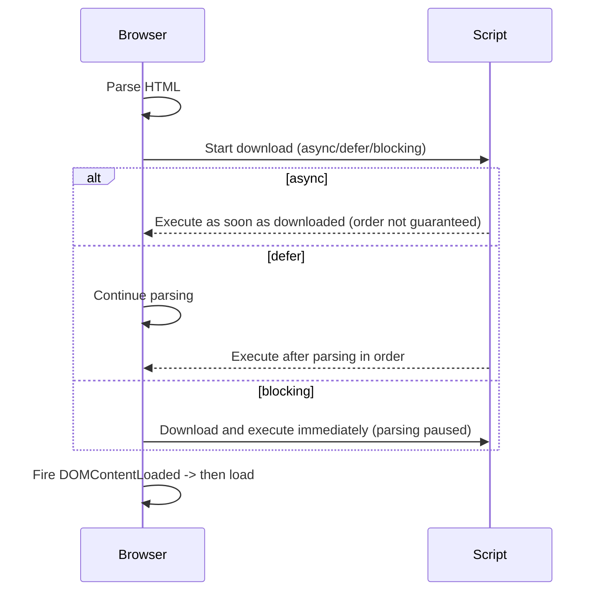

# How to Connect JavaScript Files to HTML

---

## Quick summary (one-line)

* Put small scripts in the `<head>` only if they must run before content rendering. Otherwise prefer `defer` on external scripts or place scripts before `</body>`.
* Use `async` for independent scripts (analytics, ads) that don't rely on DOM or other scripts.
* Use `defer` for application scripts that need the full DOM and must preserve execution order.

---

## 1. Ways to include JavaScript in HTML

1. **Inline script inside HTML**

```html
<!-- inline script -->
<script>
  console.log('Hello from inline script');
</script>
```

2. **External script (default)**

```html
<script src="app.js"></script>
```

3. **Module script**

```html
<script type="module" src="app.module.js"></script>
```

4. **Async / Defer attributes**

```html
<!-- async example -->
<script async src="analytics.js"></script>

<!-- defer example -->
<script defer src="app.js"></script>
```

---

## 2. Where to put the `<script>` tag and why

### A. At end of `<body>` (classic approach)

```html
<!-- index.html -->
<body>
  <!-- page content -->
  <script src="app.js"></script>
</body>
```

* Browser downloads the HTML, builds DOM, then downloads & executes the script.
* Simple and works for scripts that need the DOM.
* But it blocks painting while the script loads and executes at that point.

### B. In `<head>` without attributes

```html
<head>
  <script src="app.js"></script>
</head>
```

* The browser pauses HTML parsing to download and run the script.
* This can delay page rendering (bad for performance) if the script is large.

### C. In `<head>` with `defer`

```html
<head>
  <script defer src="app.js"></script>
</head>
```

* Browser downloads script while parsing HTML, but **executes it after the DOM is fully parsed** (before `DOMContentLoaded`).
* Preserves the order of scripts.
* Great for application code that needs the DOM.

### D. In `<head>` with `async`

```html
<head>
  <script async src="analytics.js"></script>
</head>
```

* Browser downloads the script while parsing HTML and **executes it as soon as it finishes downloading** — order is *not* guaranteed.
* Use for independent scripts (analytics, ads), not for scripts that rely on DOM or other scripts.

---

## 3. Detailed differences: `async` vs `defer` vs no attribute

```mermaid
flowchart LR
  HTML[HTML Parser] -->|encounters script without attr| BLOCK[Stops parsing -> download -> execute -> continue parsing]
  HTML -->|encounters script defer| DOWNLOAD_DEFER[Download in background] -->|after parsing| EXEC_DEFER[Execute in order]
  HTML -->|encounters script async| DOWNLOAD_ASYNC[Download in background] -->|when downloaded| EXEC_ASYNC[Execute immediately (order not guaranteed)]
```

**No attribute (default)**

* Script is downloaded and executed **immediately**, blocking HTML parsing until done.
* Use only when script must run right away and may modify `document.write()` or other parse-time behavior.

**`defer`**

* Non-blocking download during parse.
* Executes after parsing finishes, in the order the `defer` scripts appear.
* `defer` works only for external scripts (ignored on inline).
* Adds predictability for app initialization.

**`async`**

* Non-blocking download during parse.
* Executes immediately when download finishes — order may vary.
* Good for small, independent scripts.

---

## 4. What happens if you don't use `async` or `defer`?

* The browser will **stop parsing the HTML** when it reaches the `<script src="..."></script>` tag, download the file, execute it, and then continue parsing. This can make the page load slower and create a bad user experience on slow networks.

* Example problem: if your script is large and placed in `<head>`, the visible page will not render until the script finishes executing.

---

## 5. `type="module"` (ES Modules)

```html
<script type="module" src="main.js"></script>
```

* Module scripts are **deferred by default** (they behave like `defer`).
* They support `import`/`export` syntax.
* They run in strict mode and have their own scope (no global `this`).
* Modules load with CORS checks; if you host modules across domains, ensure correct `Access-Control-Allow-Origin` headers.

---

## 6. DOM events: `DOMContentLoaded` vs `load`

* `DOMContentLoaded` fires when the HTML is parsed and DOM tree is built (stylesheets/images might still be loading).
* `load` fires when the whole page, including images and sub-resources, has fully loaded.

```html
<script>
  document.addEventListener('DOMContentLoaded', () => {
    console.log('DOM ready — safe to query elements');
  });

  window.addEventListener('load', () => {
    console.log('Page fully loaded — images and other resources ready');
  });
</script>
```

* If you use `defer`, your scripts run **before** `DOMContentLoaded` fires.

---

## 7. Examples & Best Practices

### Example A — App script that needs DOM (use `defer`)

```html
<!doctype html>
<html>
<head>
  <meta charset="utf-8">
  <title>My App</title>
  <script defer src="/js/app.js"></script>
</head>
<body>
  <div id="root"></div>
</body>
</html>
```

`app.js` can safely query `#root` because it runs after DOM parsing finishes.

### Example B — Analytics (use `async`)

```html
<head>
  <script async src="/js/analytics.js"></script>
</head>
```

Analytics runs when ready and should not block page rendering.

### Example C — Small inline script used early

```html
<head>
  <script>
    // small inline config; keep very small
    window.appConfig = { theme: 'light' };
  </script>
  <script defer src="/js/app.js"></script>
</head>
```

### Example D — Module import

```html
<script type="module">
  import { init } from './js/main.js';
  init();
</script>
```

---

## 8. When to place `<script>` in `<head>` vs. before `</body>`

* Use `<head>` + `defer` for predictable, ordered execution and fast DOM availability.
* Use `<head>` + `async` for independent scripts (ads, analytics).
* Place script before `</body>` only if you cannot use `defer` and your script needs the DOM.

---

## 9. Performance tips

* Minify and compress JS (gzip / brotli).
* Use HTTP/2 or HTTP/3 to allow parallel downloads.
* Combine critical small inline config and defer large app scripts.
* Use `preload` for important resources if needed:

```html
<link rel="preload" href="/js/app.js" as="script">
```

---

## 10. Mermaid diagrams included

1. Script loading comparison (async / defer / blocking)
2. Typical page load timeline with `DOMContentLoaded` and `load` events



---

## 11. Notes about your Excalidraw diagram

If your Excalidraw diagram compares placement vs behaviour, include it in `assets/diagrams/` in PNG or SVG form for the README. Mermaid diagrams in this README cover the same flows and can be used on GitHub which supports Mermaid rendering.

---

## 12. Checklist for students (quick)

* [ ] Use `defer` for app scripts that rely on DOM.
* [ ] Use `async` for independent third-party scripts.
* [ ] Prefer `type="module"` for modern JS and packages.
* [ ] Avoid large blocking scripts in `<head>` without `defer` or `async`.

---

**Done.** This README is ready to paste into your repo. It includes code examples, Mermaid diagrams, and practical best practices for connecting JS files to HTML.
