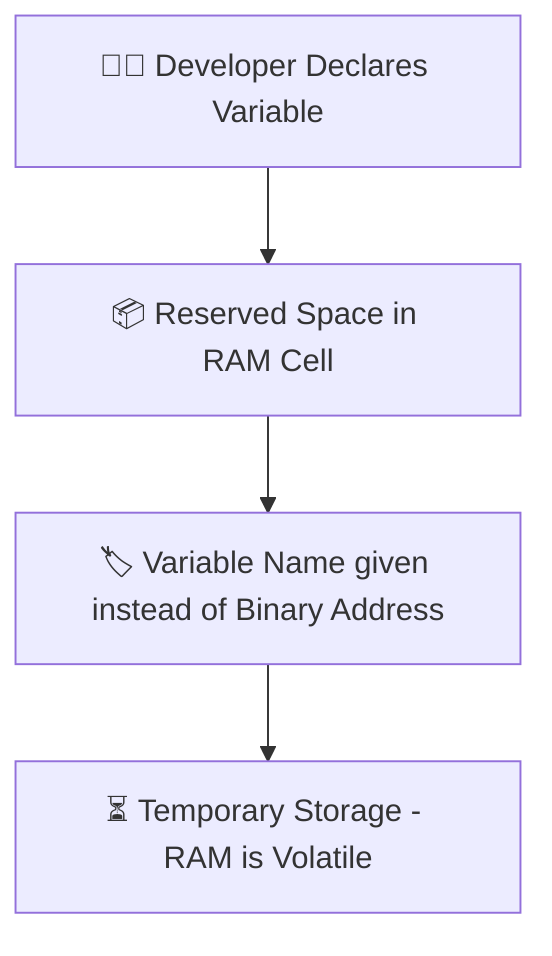

# 📝 JavaScript Variables

---

## 🔹 What Are Variables?

Variables are used to **store data** in JavaScript. Think of them as containers 🗃️ that hold values like numbers, strings, or objects.

👉 A variable is just a space in **RAM memory**. When you create a variable, you actually reserve **one cell out of thousands of cells in RAM**. Each memory cell has a **unique binary address**. Since it’s hard to remember binary addresses, we give names (identifiers) to variables.

⚡ Important: Variables only store data **temporarily** because RAM is **volatile memory** — data is lost when the power is off.

---

## 💡 Why Are Variables Important?

* 🛑 **Store Data** → Without variables, data cannot be saved for later use.
* 🔄 **Dynamic & Reusable Code** → Programs can handle different inputs without rewriting.

---

## ⚙️ Syntax

```js
let/const/var variableName = value;
```

* **Specifier:** `let`, `const`, or `var`
* **Controls:**

  * 📦 **Storage**
  * 🔒 **Accessibility (scope)**
  * 🔁 **Reassignment rules**

---

## 🛠️ Two Key Steps When Creating Variables

1. **Declaration** → Telling JS you want a variable.

   ```js
   let age;
   ```
2. **Initialization** → Giving it a value.

   ```js
   age = 21;
   ```

---

## 📜 Rules for Naming Variables

✔️ Valid:

* Can start with **letters**, `_` (underscore), or `$` (dollar).
* Use **camelCase** (`userName`) or **snake\_case** (`user_name`).

❌ Invalid:

* Cannot start with a number (`1name`).
* Cannot use spaces (`user name`).
* Cannot use reserved keywords (`let`, `if`, `class`).

👉 Variables are **case-sensitive**: `Name` and `name` are different.

---

## 🌍 Variable Scope

| Specifier | Scope           | Redeclare? | Reassign? |
| --------- | --------------- | ---------- | --------- |
| `var`     | Function-scoped | ✅ Yes      | ✅ Yes     |
| `let`     | Block-scoped    | ❌ No       | ✅ Yes     |
| `const`   | Block-scoped    | ❌ No       | ❌ No      |

---

## 🧩 Data Types

### 📌 Primitive (Stored in Stack → Pass by Value)

| Type      | Example                |
| --------- | ---------------------- |
| String    | `"Hello"`              |
| Number    | `42`, `3.14`           |
| Boolean   | `true`, `false`        |
| Null      | `null`                 |
| Undefined | `undefined`            |
| Symbol    | `Symbol("id")`         |
| BigInt    | `1234567890123456789n` |

### 📌 Non-Primitive (Reference Types → Stored in Heap)

| Type     | Example                     |
| -------- | --------------------------- |
| Object   | `{ name: "Rana", age: 22 }` |
| Array    | `["apple", "banana"]`       |
| Function | `function greet(){}`        |

---

## 🛠️ Primitive

```js
// Primitive (copy by value)
let fruit = "Mango";
fruit = "Kiwi"; 
console.log(fruit); // "Kiwi"

let vegetable = "Carrots";
fruit = vegetable;  
console.log(fruit); // "Carrots"

// Changing vegetable later won’t affect fruit
vegetable = "Potato";
console.log(fruit); // still "Carrots"
```

---

## 🧪 Special Notes

* 🔄 **Dynamic Typing** → A variable can change type at runtime.

  ```js
  let data = 100;   // number
  data = "Hello";   // now string
  ```

* 🕵️ **Type Checking** → Use `typeof`

  ```js
  console.log(typeof 42);       // number
  console.log(typeof "Hello");  // string
  ```

* ⚠️ **undefined vs null**

  * `undefined`: Assigned automatically to uninitialized variables.
  * `null`: Manually assigned to represent "no value".

---

## 🗂️ Diagram – Variable in RAM Memory



---

## 🏆 Challenge Time!

Try to solve these small challenges 👇

1. Declare three variables using `var`, `let`, and `const`. Print them using `console.log()`.
2. Create a variable called `city` and assign `"Karachi"`. Reassign it to `"Lahore"`. Try with `let` and `const`. What happens?
3. Write code that stores a number, then changes it into a string. Use `typeof` to check type before and after.
5. What will be the output?

   ```js
   let a;
   console.log(a); 

   let b = null;
   console.log(b);
   ```
