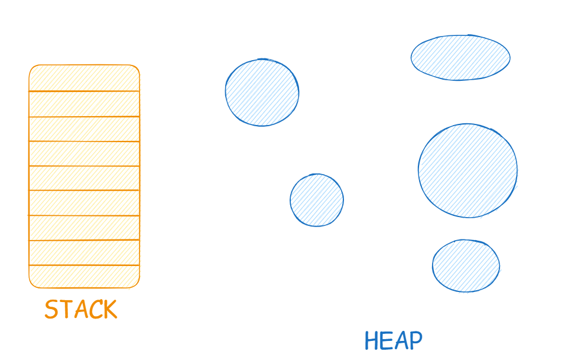

# 📝 JavaScript Variables + String Quotation & Concatenation

---

## 🔹 What Are Variables?

A **variable** in JavaScript is like a **named container** 🗃️ that holds data temporarily in the computer’s **RAM (Random Access Memory)** while your program is running.

Whenever you create a variable, JavaScript allocates a **memory cell** in RAM and associates it with the variable name you provide.

👉 Think of RAM as a large grid of tiny storage boxes.
Each box has a **unique binary address** (like `10101101`), but instead of remembering that address, we assign a readable **name** to it — the **variable name**.

⚡ **Important:**
RAM is **volatile**, meaning all data stored in variables disappears when the program ends or the computer shuts down.

---

### 🧩 **Example**

```js
let name = "Rana";
let age = 21;
```

🧠 Here:

* `"Rana"` is stored in memory.
* The variable `name` points to that memory location.
* Same goes for `age = 21`.

📸 **Memory Visualization:**

| Variable | Value  | Memory Address |
| -------- | ------ | -------------- |
| `name`   | "Rana" | 0x101A         |
| `age`    | 21     | 0x101B         |

---
## 💡 **Why Are Variables Important?**

Variables make code:

1. 🧍‍♂️ **Dynamic** — handle different inputs easily.
2. 🔁 **Reusable** — use stored data multiple times.
3. 📦 **Organized** — store different types of data (strings, numbers, objects, arrays, etc.).
4. ⚙️ **Maintainable** — changing one variable updates all references automatically.

---

## ⚙️ **Syntax**

```js
let/const/var variableName = value;
```
### ✳️ **Specifier:**

* **Specifier:** `let`, `const`, or `var`

The **specifier** defines **how the variable behaves** in terms of storage, scope, and reassignment.

| Specifier | Description                                                                             |
| --------- | --------------------------------------------------------------------------------------- |
| `var`     | Oldest way to declare variables (before ES6). Function-scoped and allows redeclaration. |
| `let`     | Introduced in ES6. Block-scoped and prevents redeclaration.                             |
| `const`   | Used for constants — cannot be redeclared or rea

---

### 🔧 **Specifier Controls**

#### 📦 1. **Storage**

Defines **where and how** the variable’s data is kept in memory while the program runs.
JavaScript uses memory dynamically — when you declare a variable, space is reserved in RAM.

```js
let city = "Karachi"; // Stored temporarily in memory
```

#### 🔒 2. **Accessibility (Scope)**

Determines **where** the variable can be accessed in your code — inside a function, a block, or globally. (Explained in detail below.)

#### 🔁 3. **Reassignment Rules**

Defines **whether you can change** the value after assigning it once.

```js
let name = "Rana";
name = "Waqar"; // ✅ allowed

const country = "Pakistan";
country = "USA"; // ❌ Error - cannot reassign const
```

---

## 🛠️ Two Key Steps When Creating Variables

1. **Declaration** → Telling JS you want a variable.

   ```js
   let age;
   ```
2. **Initialization** → Giving it a value.

   ```js
   age = 21;
   ```

You can also **declare and initialize in one line**:

```js
let age = 21;
```
---

## 📜 Rules for Naming Variables

1) ❌ Can't start with a number (you can add numbers after or inside the variable name).
2) ❌ Can't start or end with a special character (except _ or $).
3) ❌ Can't use spaces in variable names.
4) ✅ Use camelCase (userName) or snake_case (user_name) for multi-word names.
5) ❌ Can't use keywords (if, else, for, while, let, etc.) or reserved keywords.
6) ⚠️ JavaScript is case-sensitive — Name and name are different variables.

---

## 🌍 Variable Scope

Scope means **where** your variable is accessible in the code.

| Specifier | Scope           | Redeclare? | Reassign? |
| --------- | --------------- | ---------- | --------- |
| `var`     | Function-scoped | ✅ Yes      | ✅ Yes     |
| `let`     | Block-scoped    | ❌ No       | ✅ Yes     |
| `const`   | Block-scoped    | ❌ No       | ❌ No      |

---

### 📘 **1. var — Function Scope**

* Accessible anywhere **inside the same function**.
* If declared globally, it becomes part of the **window object** (in browsers).

```js
function greet() {
  var message = "Hello World!";
  console.log(message); // ✅ Accessible here
}
console.log(message); // ❌ Error
```

🧩 If declared outside any function:

```js
var country = "Pakistan";
console.log(window.country); // ✅ Works (global variable)
```

📸 **Visual Example:**

```
Global Scope
│
├── function greet() {
│     var message = "Hello";
│     console.log(message); // Accessible
│   }
│
└── console.log(message); // Not accessible
```

---

### 📗 **2. let — Block Scope**

* Accessible **only inside** the `{ }` block where it’s defined.
* Cannot be redeclared in the same scope.

```js
if (true) {
  let city = "Lahore";
  console.log(city); // ✅ Works
}
console.log(city); // ❌ Error
```

📸 **Block Scope Diagram:**

```
Global Scope
│
├── { 
│     let city = "Lahore"; // Exists only inside block
│   }
│
└── console.log(city); // Not accessible
```

---

### 📙 **3. const — Constant Value**

* Must be **initialized immediately**.
* Value **cannot be changed** or redeclared.
* Also **block-scoped**.

```js
const PI = 3.14159;
PI = 3.14; // ❌ Error
```

📸 **Concept Image:**

```
const PI = 3.14159; // Locked value — cannot be reassigned
```

---
## Diagram


---

## 🧩 **JavaScript Data Types**

In JavaScript, **data types** define the kind of value a variable can hold.
They help the computer know how to **store, process, and operate** on data.

JavaScript is a **dynamically typed language**, meaning you don’t need to declare a variable’s type — it’s determined **automatically at runtime**.

---

## 🧠 **Main Categories of Data Types**

JavaScript has two main categories:

| Category                            | Stored In | Passed As    | Example                     |
| ----------------------------------- | --------- | ------------ | --------------------------- |
| **Primitive**                       | Stack     | By Value     | `"Hello"`, `42`, `true`     |
| **Non-Primitive (Reference Types)** | Heap      | By Reference | `{}`, `[]`, `function() {}` |

---

### 🔹 **Primitive Data Types**

Primitive data types store **single, immutable values** (cannot be modified directly).

| Type          | Description                                                   | Example                               |
| ------------- | ------------------------------------------------------------- | ------------------------------------- |
| **String**    | Sequence of characters (text).                                | `"Rana"`, `'Hello'`, `` `Welcome!` `` |
| **Number**    | Numeric values (integer or decimal).                          | `42`, `3.14`, `-10`                   |
| **Boolean**   | Logical values — only `true` or `false`.                      | `true`, `false`                       |
| **Undefined** | A variable that has been declared but not assigned any value. | `let x; // undefined`                 |
| **Null**      | Represents intentional absence of a value.                    | `let y = null;`                       |
| **Symbol**    | A unique and immutable value (used for object property keys). | `Symbol("id")`                        |
| **BigInt**    | For integers beyond the safe limit of regular numbers.        | `1234567890123456789n` 

---

### 🧪 **Examples of Primitive Data Types**

```js
let name = "Waqar";         // String
let age = 22;               // Number
let isStudent = true;       // Boolean
let car;                    // Undefined
let salary = null;          // Null
let id = Symbol("id");      // Symbol
let bigNumber = 9007199254740991n; // BigInt
```

---

### 🧱 **Stored in Stack (Pass by Value)**

Each primitive variable **holds a copy** of the actual value.

```js
let fruit = "Mango";
let anotherFruit = fruit; // copy value
anotherFruit = "Kiwi";

console.log(fruit);        // "Mango"
console.log(anotherFruit); // "Kiwi"
```

🧠 **Explanation:**
Each variable stores a separate copy — changing one doesn’t affect the other.

📸 **Visual Representation (Stack Memory):**

```
fruit        →  "Mango"
anotherFruit →  "Kiwi"
```

---

### 🔹 **Non-Primitive (Reference) Data Types**

Non-primitive types **store references (addresses)** to values stored in the **Heap memory**.
That means multiple variables can **point to the same object**.

| Type         | Description                                      | Example                        |
| ------------ | ------------------------------------------------ | ------------------------------ |
| **Object**   | Collection of key–value pairs.                   | `{ name: "Rana", age: 22 }`    |
| **Array**    | Ordered list of values (special type of object). | `["apple", "banana", "mango"]` |
| **Function** | Block of reusable code.                          | `function greet() {}`          |

---

### 🧪 **Examples of Non-Primitive Data Types**

```js
// Object
let student = { name: "Rana", age: 22, course: "Web Dev" };

// Array
let fruits = ["Apple", "Banana", "Mango"];

// Function
function greet() {
  console.log("Hello, World!");
}
```

---

### 🧩 **Stored in Heap (Pass by Reference)**

```js
let user = { name: "Rana" };
let newUser = user; // reference to the same object

newUser.name = "Waqar";

console.log(user.name);    // "Waqar"
console.log(newUser.name); // "Waqar"
```

🧠 **Explanation:**
Both variables point to the **same memory location** in heap — changing one affects the other.

📸 **Visual Representation (Heap Memory):**

```
user    ─┐
         ├──> { name: "Waqar" }
newUser ─┘
```

---

## 🖼️ **Visual Diagrams**



---

## ⚙️ **Dynamic Typing**

In JavaScript, a variable’s data type can **change during runtime**.

```js
let data = 100;     // Number
data = "Hello";     // String
data = true;        // Boolean
```

✅ JavaScript automatically updates the variable’s type based on the new value.

---

## 🔍 **Type Checking**

You can check a variable’s data type using the **`typeof`** operator.

```js
console.log(typeof 42);        // "number"
console.log(typeof "Hello");   // "string"
console.log(typeof true);      // "boolean"
console.log(typeof undefined); // "undefined"
console.log(typeof null);      // "object" ❗ (JavaScript bug since 1995)
console.log(typeof Symbol("id")); // "symbol"
console.log(typeof 123n);      // "bigint"
console.log(typeof [1, 2, 3]); // "object"
console.log(typeof { name: "Rana" }); // "object"
console.log(typeof function(){}); // "function"
```

---

## ⚠️ **Undefined vs Null**

| Property    | `undefined`                                       | `null`                    |
| ----------- | ------------------------------------------------- | ------------------------- |
| **Meaning** | Automatically assigned to uninitialized variables | Manually set by developer |
| **Type**    | `undefined`                                       | `object`                  |
| **Usage**   | Missing or uninitialized data                     | Intentional empty value   |

### 🧪 Example:

```js
let a;
let b = null;

console.log(a); // undefined
console.log(b); // null
```

---

## 💥 **NaN (Not-a-Number)**

`NaN` is a special numeric value that means the result of an invalid mathematical operation.

```js
console.log(10 / "Hello"); // NaN
console.log(typeof NaN);   // "number"
```

✅ Use `isNaN()` to check:

```js
console.log(isNaN(10));       // false
console.log(isNaN("Hello"));  // true
```

---

## 🧠 **Summary Table**

| Category          | Type      | Example            | Mutable? | Stored In | Passed By |
| ----------------- | --------- | ------------------ | -------- | --------- | --------- |
| **Primitive**     | String    | `"Hello"`          | ❌ No     | Stack     | Value     |
|                   | Number    | `42`               | ❌        | Stack     | Value     |
|                   | Boolean   | `true`             | ❌        | Stack     | Value     |
|                   | Undefined | `undefined`        | ❌        | Stack     | Value     |
|                   | Null      | `null`             | ❌        | Stack     | Value     |
|                   | Symbol    | `Symbol("id")`     | ❌        | Stack     | Value     |
|                   | BigInt    | `123n`             | ❌        | Stack     | Value     |
| **Non-Primitive** | Object    | `{ name: "Rana" }` | ✅        | Heap      | Reference |
|                   | Array     | `[1, 2, 3]`        | ✅        | Heap      | Reference |
|                   | Function  | `function(){}`     | ✅        | Heap      | Reference |

---

## 🔹 1. Quotation in JavaScript

Strings in JavaScript can be enclosed in **single quotes (`'`)** or **double quotes (`"`)**. Choosing the right quotes helps avoid errors when your string contains quotes.

Use double quotes `"` when your string contains a single quote `'`:

```javascript
let message = "It's a sunny day!";
console.log(message); // Output: It's a sunny day!
```

### 🟢 Escaping Single Quote

Use a backslash `\` to escape a single quote `'` if your string uses single quotes:

```javascript
let message = 'It\'s a sunny day!';
console.log(message); // Output: It's a sunny day!
```

Escape sequences are **special characters in a string** that perform a specific action or represent characters that are otherwise hard to type. They start with a **backslash `\`**.

> An **escape sequence** allows you to include special characters in a string, such as newlines, tabs, quotes, or Unicode characters, without breaking the string syntax.

### 🧩 Basic Escape Sequences in JavaScript

| Escape Sequence | Meaning / Description        | Example                          |
| --------------- | ---------------------------- | -------------------------------- |
| `\'`            | Single quote                 | `'It\'s sunny'`                  |
| `\"`            | Double quote                 | `"She said \"Hi\""`              |
| `\\`            | Backslash                    | `'Folder path: C:\\Users\\Rana'` |
| `\n`            | Newline / line break         | `'Hello\nWorld'`                 |
| `\t`            | Tab space                    | `'Name:\tRana'`                  |\
| `\b`            | Backspace                    | `'abc\b'` → prints `ac`          |

### 🔹 Example

```javascript
console.log("Hello\tWorld"); // Tab between words
console.log("Line1\nLine2"); // Newline
console.log("She said: \"Hello!\""); // Double quotes inside string
console.log("Folder path: C:\\Users\\Rana"); // Backslash
```
---

## 🔹 2. String Concatenation

String concatenation is the process of **combining two or more strings** into one string.

### 🟢 Using the `+` Operator

```javascript
let firstName = "Waqar";
let lastName = "Rana";
let fullName = firstName + " " + lastName;

console.log(fullName); // Output: Waqar Rana
```

### 🟢 Using Template Literals (ES6+)

Template literals use **backticks (\` \`)** and allow embedding variables easily with `${}`:

```javascript
let firstName = "Waqar";
let lastName = "Rana";
let fullName = `${firstName} ${lastName}`;

console.log(fullName); // Output: Waqar Rana
```

### 🟢 Combining Strings and Other Data Types

```javascript
let age = 22;
let greeting = "My name is " + fullName + " and I am " + age + " years old.";
console.log(greeting); 
// Output: My name is Waqar Rana and I am 22 years old.
```

```javascript
// Using template literals
let greeting2 = `My name is ${fullName} and I am ${age} years old.`;
console.log(greeting2); 
// Output: My name is Waqar Rana and I am 22 years old.
```

---

## 💡 Notes

* ✅ Always match opening and closing quotes.
* ✅ Template literals make concatenation easier and more readable.
* ⚠️ Be careful with quotes inside quotes; use escaping or double quotes as needed.

---

## 🏆 Challenge Time!

Try to solve these small challenges 👇

1. Declare three variables using `var`, `let`, and `const`. Print them using `console.log()`.
2. Create a variable called `city` and assign `"Karachi"`. Reassign it to `"Lahore"`. Try with `let` and `const`. What happens?
3. Write code that stores a number, then changes it into a string. Use `typeof` to check type before and after.
4. Create a variable `sentence` that says: `I am learning JavaScript!` using **double quotes**.
5. Create a variable `sentence2` with the same text using **single quotes** and escaping.
6. Combine your first name and last name into a `fullName` variable using **both `+` operator** and **template literals**.
7. Print a sentence: `"Hello, my name is [fullName] and I love coding!"` using template literals.
8. What will be the output?

   ```js
   let a;
   console.log(a); 

   let b = null;
   console.log(b);
   ```
