# 📝 JavaScript Variables + String Quotation & Concatenation

---

## 🔹 What Are Variables?

Variables are used to **store data** in JavaScript. Think of them as containers 🗃️ that hold values like numbers, strings, or objects.

👉 A variable is just a space in **RAM memory**. When you create a variable, you actually reserve **one cell out of thousands of cells in RAM**. Each memory cell has a **unique binary address**. Since it’s hard to remember binary addresses, we give names (identifiers) to variables.

⚡ Important: Variables only store data **temporarily** because RAM is **volatile memory** — data is lost when the power is off.

---

## 💡 Why Are Variables Important?

* 🛑 **Store Data** → Without variables, data cannot be saved for later use.
* 🔄 **Dynamic & Reusable Code** → Programs can handle different inputs without rewriting.

---

## ⚙️ Syntax

```js
let/const/var variableName = value;
```

* **Specifier:** `let`, `const`, or `var`
* **Controls:**

  * 📦 **Storage**
  * 🔒 **Accessibility (scope)**
  * 🔁 **Reassignment rules**

---

## 🛠️ Two Key Steps When Creating Variables

1. **Declaration** → Telling JS you want a variable.

   ```js
   let age;
   ```
2. **Initialization** → Giving it a value.

   ```js
   age = 21;
   ```

---

## 📜 Rules for Naming Variables

✔️ Valid:

* Can start with **letters**, `_` (underscore), or `$` (dollar).
* Use **camelCase** (`userName`) or **snake\_case** (`user_name`).

❌ Invalid:

* Cannot start with a number (`1name`).
* Cannot use spaces (`user name`).
* Cannot use reserved keywords (`let`, `if`, `class`).

👉 Variables are **case-sensitive**: `Name` and `name` are different.

---

## 🌍 Variable Scope

| Specifier | Scope           | Redeclare? | Reassign? |
| --------- | --------------- | ---------- | --------- |
| `var`     | Function-scoped | ✅ Yes      | ✅ Yes     |
| `let`     | Block-scoped    | ❌ No       | ✅ Yes     |
| `const`   | Block-scoped    | ❌ No       | ❌ No      |

---

## 🧩 Data Types

### 📌 Primitive (Stored in Stack → Pass by Value)

| Type      | Example                |
| --------- | ---------------------- |
| String    | `"Hello"`              |
| Number    | `42`, `3.14`           |
| Boolean   | `true`, `false`        |
| Null      | `null`                 |
| Undefined | `undefined`            |
| Symbol    | `Symbol("id")`         |
| BigInt    | `1234567890123456789n` |

### 📌 Non-Primitive (Reference Types → Stored in Heap)

| Type     | Example                     |
| -------- | --------------------------- |
| Object   | `{ name: "Rana", age: 22 }` |
| Array    | `["apple", "banana"]`       |
| Function | `function greet(){}`        |

---

## 🛠️ Primitive

```js
// Primitive (copy by value)
let fruit = "Mango";
fruit = "Kiwi"; 
console.log(fruit); // "Kiwi"

let vegetable = "Carrots";
fruit = vegetable;  
console.log(fruit); // "Carrots"

// Changing vegetable later won’t affect fruit
vegetable = "Potato";
console.log(fruit); // still "Carrots"
```

---

## 🧪 Special Notes

* 🔄 **Dynamic Typing** → A variable can change type at runtime.

  ```js
  let data = 100;   // number
  data = "Hello";   // now string
  ```

* 🕵️ **Type Checking** → Use `typeof`

  ```js
  console.log(typeof 42);       // number
  console.log(typeof "Hello");  // string
  ```

* ⚠️ **undefined vs null**

  * `undefined`: Assigned automatically to uninitialized variables.
  * `null`: Manually assigned to represent "no value".

---

## 🗂️ Diagram – Variable in RAM Memory

```mermaid
graph TD;
  A[🧑‍💻 Developer Declares Variable] --> B[📦 Reserved Space in RAM Cell]
  B --> C[🏷️ Variable Name given instead of Binary Address]
  C --> D[⏳ Temporary Storage - RAM is Volatile]
```



---

# 📝 JavaScript Strings: Quotation & Concatenation

---

## 🔹 1. Quotation in JavaScript

Strings in JavaScript can be enclosed in **single quotes (`'`)** or **double quotes (`"`)**. Choosing the right quotes helps avoid errors when your string contains quotes.

Use double quotes `"` when your string contains a single quote `'`:

```javascript
let message = "It's a sunny day!";
console.log(message); // Output: It's a sunny day!
```

### 🟢 Escaping Single Quote

Use a backslash `\` to escape a single quote `'` if your string uses single quotes:

```javascript
let message = 'It\'s a sunny day!';
console.log(message); // Output: It's a sunny day!
```

Escape sequences are **special characters in a string** that perform a specific action or represent characters that are otherwise hard to type. They start with a **backslash `\`**.

> An **escape sequence** allows you to include special characters in a string, such as newlines, tabs, quotes, or Unicode characters, without breaking the string syntax.

### 🧩 Basic Escape Sequences in JavaScript

| Escape Sequence | Meaning / Description        | Example                          |
| --------------- | ---------------------------- | -------------------------------- |
| `\'`            | Single quote                 | `'It\'s sunny'`                  |
| `\"`            | Double quote                 | `"She said \"Hi\""`              |
| `\\`            | Backslash                    | `'Folder path: C:\\Users\\Rana'` |
| `\n`            | Newline / line break         | `'Hello\nWorld'`                 |
| `\t`            | Tab space                    | `'Name:\tRana'`                  |\
| `\b`            | Backspace                    | `'abc\b'` → prints `ac`          |

### 🔹 Example

```javascript
console.log("Hello\tWorld"); // Tab between words
console.log("Line1\nLine2"); // Newline
console.log("She said: \"Hello!\""); // Double quotes inside string
console.log("Folder path: C:\\Users\\Rana"); // Backslash
```
---

## 🔹 2. String Concatenation

String concatenation is the process of **combining two or more strings** into one string.

### 🟢 Using the `+` Operator

```javascript
let firstName = "Waqar";
let lastName = "Rana";
let fullName = firstName + " " + lastName;

console.log(fullName); // Output: Waqar Rana
```

### 🟢 Using Template Literals (ES6+)

Template literals use **backticks (\` \`)** and allow embedding variables easily with `${}`:

```javascript
let firstName = "Waqar";
let lastName = "Rana";
let fullName = `${firstName} ${lastName}`;

console.log(fullName); // Output: Waqar Rana
```

### 🟢 Combining Strings and Other Data Types

```javascript
let age = 22;
let greeting = "My name is " + fullName + " and I am " + age + " years old.";
console.log(greeting); 
// Output: My name is Waqar Rana and I am 22 years old.
```

```javascript
// Using template literals
let greeting2 = `My name is ${fullName} and I am ${age} years old.`;
console.log(greeting2); 
// Output: My name is Waqar Rana and I am 22 years old.
```

---

## 💡 Notes

* ✅ Always match opening and closing quotes.
* ✅ Template literals make concatenation easier and more readable.
* ⚠️ Be careful with quotes inside quotes; use escaping or double quotes as needed.

---

## 🏆 Challenge Time!

Try to solve these small challenges 👇

1. Declare three variables using `var`, `let`, and `const`. Print them using `console.log()`.
2. Create a variable called `city` and assign `"Karachi"`. Reassign it to `"Lahore"`. Try with `let` and `const`. What happens?
3. Write code that stores a number, then changes it into a string. Use `typeof` to check type before and after.
4. Create a variable `sentence` that says: `I am learning JavaScript!` using **double quotes**.
5. Create a variable `sentence2` with the same text using **single quotes** and escaping.
6. Combine your first name and last name into a `fullName` variable using **both `+` operator** and **template literals**.
7. Print a sentence: `"Hello, my name is [fullName] and I love coding!"` using template literals.
8. What will be the output?

   ```js
   let a;
   console.log(a); 

   let b = null;
   console.log(b);
   ```
